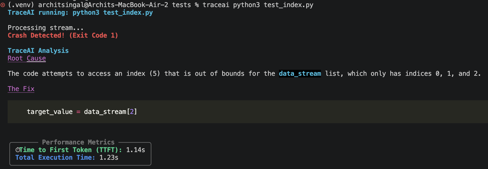

# TraceAI

## Setup and Installation

### Prerequisites
* Python 3.9 or higher
* A Google Gemini API Key configured in a `.env` file

### Installation
```bash
git clone <repository-url>
cd TraceAI
echo "GEMINI_API_KEY=your_actual_api_key_here" > .env
pip install .

```

---

## Architecture Diagram

```text
 ┌─────────────────┐       ┌─────────────────────────────────┐
 │                 │       │ Phase 1: Interceptor            │
 │  User Command   │ ─────▶│ - Spawns child process          │
 │ (traceai py...) │       │ - Pipes stdout to terminal      │
 │                 │       │ - Traps & buffers stderr        │
 └─────────────────┘       └─────────────────────────────────┘
                                           │ (If Exit Code > 0)
                                           ▼
                           ┌─────────────────────────────────┐
                           │ Phase 2: Context Gathering      │
                           │ - Regex engine parses trace     │
                           │ - Locates exact file & line     │
                           │ - Slices +/-10 lines of code    │
                           └─────────────────────────────────┘
                                           │
                                           ▼
                           ┌─────────────────────────────────┐
                           │ Phase 3: AI & Network Layer     │
                           │ - Assembles prompt payload      │
                           │ - Streams to Gemini API         │
                           └─────────────────────────────────┘
                                           │
                                           ▼
                           ┌─────────────────────────────────┐
                           │ Phase 4: UI & Metrics           │
                           │ - Rich Markdown live render     │
                           │ - Code syntax highlighting      │
                           │ - TTFT & Latency calculation    │
                           └─────────────────────────────────┘

```

---

## Demo Session



